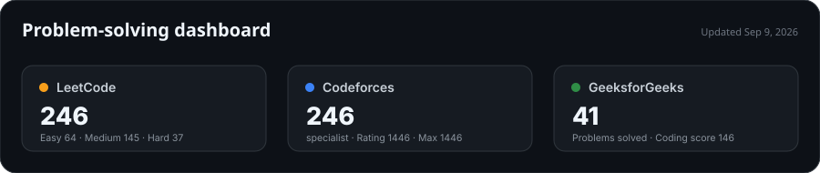

  

  
  
  

 

## Hi, I'm Amar 👋

I'm a student at BITS Pilani who likes turning hard ideas into working software. I build at the intersection of **machine learning, quantum computing, and full-stack engineering**, with a bias toward clear experiments, dependable systems, and products people actually enjoy using.

- 🔭 **Building:** applied AI/ML and quantum-computing projects
- 🧠 **Learning:** scalable ML systems, algorithms, and system design
- 🤝 **Open to:** internships, research collaborations, and ambitious open-source work
- 💬 **Ask me about:** Python, deep learning, Qiskit, or competitive programming

 

## Selected work

### 📚 StudyHelper — turn any PDF into an interactive study companion

A retrieval-augmented learning tool: it extracts and chunks a document, embeds it into a vector store on Supabase, and retrieves grounded context so users can ask natural-language questions about the material and generate self-assessment quizzes — instead of re-reading a 40-page PDF looking for one paragraph.

`Python` `Vector Embeddings` `Supabase` `RAG` `PDF Processing`

Repository is currently private — reach out if you'd like a walkthrough or early access.

### ⚛️ [GENCYS Quantum](https://github.com/awwmar/GENCYS-Quantum)

A hands-on quantum-computing learning suite covering Bell states, teleportation, Grover's algorithm, quantum random-number generation, and error correction — built to make these concepts tractable through runnable notebooks rather than just theory.

`Python` `Qiskit` `Jupyter` `Quantum Computing`

  
  

  
  

 

## Problem solving

  

  <a href="https://leetcode.com/u/awwmar/">LeetCode</a> ·
  <a href="https://codeforces.com/profile/awmar">Codeforces</a> ·
  <a href="https://www.geeksforgeeks.org/profile/awmar">GeeksforGeeks</a>

Refreshed automatically every 12 hours via GitHub Actions. "Solved" counts unique accepted problems where the platform exposes that data.

 

## Tools I reach for

  

 

  
<b>What I value as an engineer</b>

   
  I favor small, testable steps; documentation that answers real questions; honest metrics; and interfaces that make the right action obvious. I'm happiest when a project combines rigorous technical work with a visible human benefit.

 

  <i>If something here sparks an idea, I'd be glad to hear it.</i>

